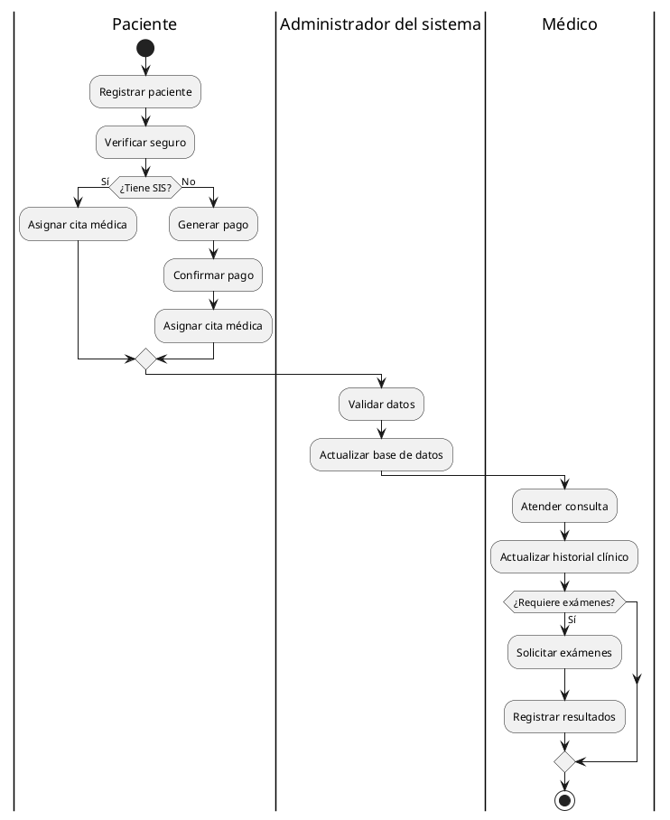

# Plataforma de Control de Maternidad en Postas Médicas

## Descripción
Este proyecto consiste en una plataforma desarrollada en **Java** con **Programación Orientada a Objetos (POO)**, que permite gestionar el control de maternidad en postas médicas de **Arequipa, Perú**. La plataforma facilita el registro de pacientes, la asignación de citas, la gestión de pagos y el almacenamiento de historiales clínicos.

## Características
- Registro de pacientes con distinción entre aseguradas (SIS) y no aseguradas.
- Gestión de citas médicas y horarios de atención.
- Control y almacenamiento de historiales clínicos.
- Administración de pagos para pacientes sin seguro.
- Optimización del flujo de trabajo del personal de salud.

## Tecnologías Utilizadas
- **Lenguaje:** Java (POO)
- **Base de Datos:** PostgreSQL
- **Frameworks:** Spring Boot (opcional)
- **Herramientas de Diagramación:** PlantUML, Draw.io

## Instalación
### Requisitos
- Java 11 o superior
- PostgreSQL instalado y configurado
- Maven o Gradle (para gestión de dependencias)

### Pasos
1. Clona el repositorio:
   ```bash
   git clone https://github.com/tu-usuario/nombre-del-repositorio.git
   ```
2. Ingresa al directorio del proyecto:
   ```bash
   cd nombre-del-repositorio
   ```
3. Configura la base de datos en `application.properties` o `config.yml`.
4. Compila y ejecuta el proyecto:
   ```bash
   mvn spring-boot:run
   ```

## Diagrama de Actividades
El siguiente diagrama representa el flujo principal del sistema:


Puedes visualizarlo en [PlantUML Online](https://www.plantuml.com/plantuml/).

## Contribución
Si deseas contribuir:
1. Haz un **fork** del repositorio.
2. Crea una nueva rama (`feature-nueva-funcionalidad`).
3. Realiza los cambios y **commitea**.
4. Envía un **pull request**.

## Licencia
Este proyecto está bajo la licencia **MIT**.
 
